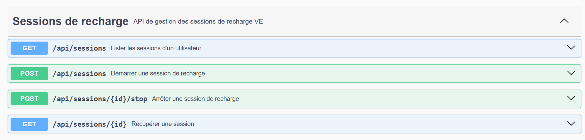
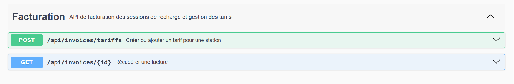
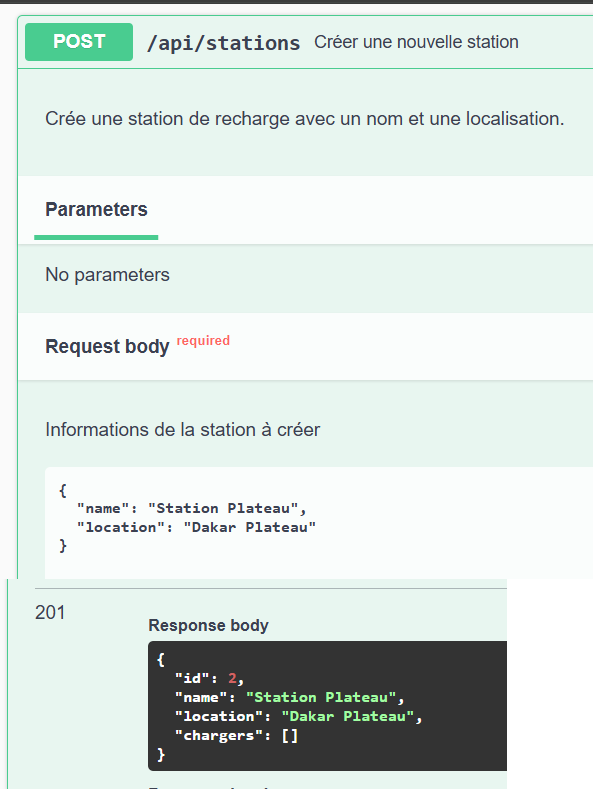
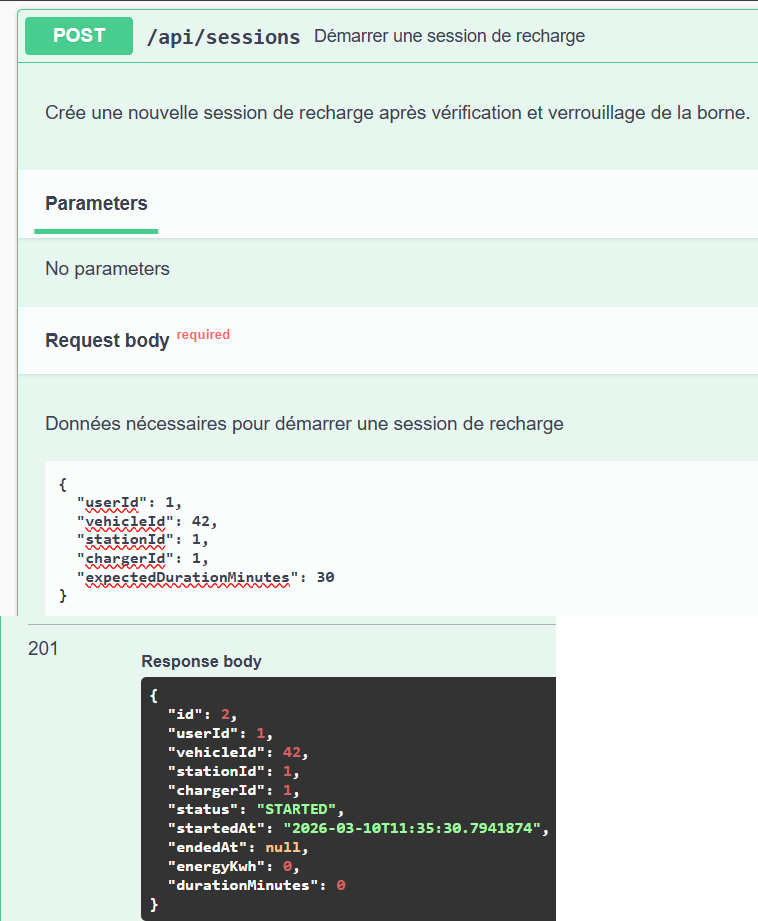
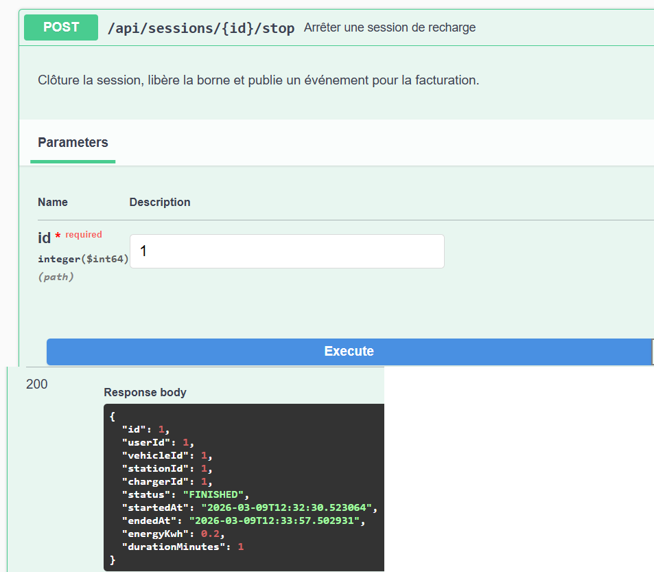
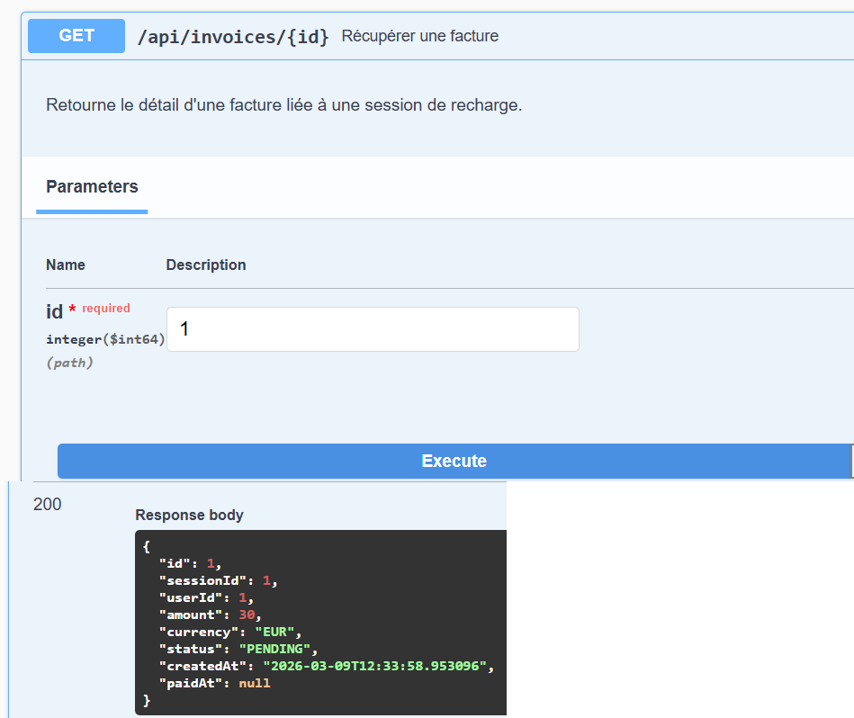

## Contexte

La plateforme **ev-charging-devsecops** a pour objectif de modéliser un système complet de **gestion de bornes de recharge pour véhicules électriques (VE)**.

Elle permet de :

- gérer un **référentiel de stations et de bornes** (emplacements, puissance, disponibilité),
- suivre le **cycle de vie des sessions de recharge** (démarrage, arrêt, historique utilisateur),
- **facturer automatiquement** les sessions en fonction de tarifs configurables par station,
- s’appuyer sur une **architecture microservices** moderne, capable d’évoluer vers de nouveaux services (notifications, reporting, etc.).

Le projet a été conçu pour être :

- **simple à lancer en local** (via Docker),
- **didactique** (structure de code claire, séparation des responsabilités),
- **testable entièrement via HTTP** grâce à Swagger UI, sans manipulation manuelle de la base de données.

---

## Architecture globale

### Microservices

- **`station-ms`** (port `8081`)
  - Gestion du **référentiel de stations et de bornes**.
  - Expose des APIs publiques et internes pour :
    - créer et lister des stations,
    - verrouiller / déverrouiller une borne.

- **`session-ms`** (port `8082`)
  - Gestion des **sessions de recharge** :
    - démarrage, arrêt, consultation.
  - Orchestre :
    - appels REST synchrones vers `station-ms` pour la réservation/libération des bornes,
    - publication d’événements de fin de session sur Kafka.

- **`billing-ms`** (port `8083`)
  - **Facturation** des sessions de recharge.
  - Gère les **tarifs par station** et crée les **factures** à partir des événements Kafka.

- **`common-ms`**
  - Module Maven partagé (bibliothèque) contenant :
    - les **DTO d’événements Kafka** (`ChargingSessionFinishedEvent`, `InvoiceCreatedEvent`, etc.),
    - des **enums métier** (`ChargingSessionStatus`, `InvoiceStatus`…).

### Communications entre microservices

- **Synchrone (REST)** :  
  `session-ms` → `station-ms`

  - Lors du démarrage de session :
    - vérifie l’état de la borne,
    - verrouille la borne si disponible.
  - Lors de l’arrêt :
    - déverrouille la borne.

- **Asynchrone (Kafka)** :  
  `session-ms` → `billing-ms`

  - Topic `charging-sessions-events` :
    - produit : `session-ms` (événement `ChargingSessionFinishedEvent`),
    - consommateur : `billing-ms` (listener `SessionEventsListener`).
  - `billing-ms` calcule le montant à partir du tarif courant et crée une `Invoice`.

### Infrastructure Docker

Le fichier `docker-compose.yml` au niveau de `ev-charging-devsecops` fournit :

- **MySQL** (`ev_charging`, port `3306`),
- **Redis** (`6379`),
- **Zookeeper** (`2181`),
- **Kafka** (`9092`),
- **Kafka UI** (`8080`) pour visualiser topics et messages.

---

## Pile technique

- **Java 17**
- **Spring Boot 3.5.10**
- **Spring Data JPA** + **MySQL** (multi‑schemas dans une même base `ev_charging`)
- **Spring Web (REST)** avec validation `jakarta.validation`
- **Spring Kafka**
- **Redis** pour le cache et les sessions (prêt à l’emploi pour station/session)
- **MapStruct** pour le mapping entités ↔ DTO
- **Lombok** pour la réduction du boilerplate
- **springdoc-openapi** (`springdoc-openapi-starter-webmvc-ui`) pour **Swagger UI**
- **Docker / docker-compose**

---

## Démarrage de l’environnement

### 1. Lancer l’infrastructure Docker

Depuis le dossier `ev-charging-devsecops` :

```bash
docker-compose up -d
docker-compose ps
```

Tu dois voir au minimum :

- `ev-charging-mysql` (Up, port `3306`),
- `ev-charging-redis` (Up, port `6379`),
- `ev-charging-zookeeper` (Up, port `2181`),
- `ev-charging-kafka` (Up, port `9092`),
- `ev-charging-kafka-ui` (Up, port `8080`).

### 2. Config Spring Boot (commune)

Chaque microservice a un `application.properties` similaire :

- `spring.datasource.url=jdbc:mysql://localhost:3306/ev_charging?createDatabaseIfNotExist=true&useSSL=false&allowPublicKeyRetrieval=true&serverTimezone=UTC`
- `spring.datasource.username=root`
- `spring.datasource.password=changeme`
- `spring.jpa.hibernate.ddl-auto=update`
- `spring.kafka.bootstrap-servers=localhost:9092`

> Pense à adapter `username`/`password` si tu modifies la configuration MySQL dans `docker-compose.yml`.

### 3. Lancer les microservices

Dans IntelliJ IDEA (recommandé) :

1. Ouvrir le projet `ev-charging-devsecops`.
2. Pour chaque microservice :
   - Ouvrir la classe `*MsApplication` correspondante.
   - Cliquer sur le bouton **Run** à côté de la méthode `main`.

Ports par défaut :

- `station-ms` : `8081`
- `session-ms` : `8082`
- `billing-ms` : `8083`

---

## Documentation Swagger (OpenAPI)

Une fois les services démarrés, accède à :

- `http://localhost:8081/swagger-ui/index.html` – API Stations
- `http://localhost:8082/swagger-ui/index.html` – API Sessions
- `http://localhost:8083/swagger-ui/index.html` – API Facturation

Les contrôleurs sont documentés avec `@Tag`, `@Operation`, `@ApiResponse`, ce qui rend l’API **auto‑documentée**.

### Exemple de capture d’écran

Les captures suivantes sont déjà présentes dans `docs/screenshots` et directement affichées ci‑dessous :





---

## Détail des APIs

### 1. `station-ms` – Stations & Bornes

**Base** : `/api/stations`

#### 1.1 Créer une station

- **POST** `/api/stations`
- **Body** :

```json
{
  "name": "Station Dakar",
  "location": "Dakar Centre"
}
```

- **Réponse** `201 Created` :

```json
{
  "id": 1,
  "name": "Station Dakar",
  "location": "Dakar Centre",
  "chargers": []
}
```

#### 1.2 Lister les stations

- **GET** `/api/stations`
- **Réponse** `200 OK` : `List<StationDto>`

#### 1.3 Détail station

- **GET** `/api/stations/{id}`
- **Réponse** `200 OK` ou `404` si introuvable.

#### 1.4 Verrouiller / Déverrouiller une borne

- **POST** `/api/stations/{stationId}/chargers/{chargerId}/lock`
- **POST** `/api/stations/{stationId}/chargers/{chargerId}/unlock`
- **Réponse** `204 No Content`

> **Exemple Swagger** : dans `station-ms`, onglet **Stations → POST /api/stations**.

---

### 2. `session-ms` – Sessions de recharge

**Base** : `/api/sessions`

#### 2.1 Démarrer une session

- **POST** `/api/sessions`
- **Body** :

```json
{
  "userId": 1,
  "vehicleId": 42,
  "stationId": 1,
  "chargerId": 1,
  "expectedDurationMinutes": 30
}
```

- **Réponse** `201 Created` :

```json
{
  "id": 1,
  "userId": 1,
  "vehicleId": 42,
  "stationId": 1,
  "chargerId": 1,
  "status": "STARTED",
  "startedAt": "2026-03-09T12:34:56",
  "endedAt": null,
  "energyKwh": 0.0,
  "durationMinutes": 0
}
```

#### 2.2 Arrêter une session

- **POST** `/api/sessions/{id}/stop`
- Calcule durée/énergie, libère la borne, envoie un événement Kafka.
- **Réponse** `200 OK` :

```json
{
  "id": 1,
  "status": "FINISHED",
  "durationMinutes": 12,
  "energyKwh": 2.4,
  ...
}
```

#### 2.3 Détail & liste

- **GET** `/api/sessions/{id}` → `ChargingSessionResponse`
- **GET** `/api/sessions?userId=1` → `List<ChargingSessionResponse>`

> **Exemple Swagger** : dans `session-ms`, onglet **Sessions de recharge → POST /api/sessions**.

---

### 3. `billing-ms` – Tarifs & Factures

**Base** : `/api/invoices`

#### 3.1 Créer un tarif

- **POST** `/api/invoices/tariffs`
- **Body** :

```json
{
  "stationId": 1,
  "pricePerKwh": 100.0,
  "pricePerMinute": 10.0,
  "idlePenaltyPerMinute": 0.0
}
```

- **Réponse** `201 Created`

#### 3.2 Récupérer une facture

- **GET** `/api/invoices/{id}`
- **Réponse** `200 OK` :

```json
{
  "id": 1,
  "sessionId": 1,
  "userId": 1,
  "amount": 1500.0,
  "currency": "EUR",
  "status": "PENDING",
  "createdAt": "2026-03-09T12:40:00",
  "paidAt": null
}
```

> **Flux asynchrone** : cette facture est créée automatiquement lorsque `billing-ms` reçoit un `ChargingSessionFinishedEvent` sur Kafka après l’appel `POST /api/sessions/{id}/stop`.

---

## Scénario de test de bout en bout (via Swagger)

1. **Créer une station**
   - Swagger `station-ms` → `POST /api/stations`
   - Input : `"Station Dakar" / "Dakar Centre"`
   - Récupérer `id` de la station (ex. `1`).

2. **Créer un tarif pour cette station**
   - Swagger `billing-ms` → `POST /api/invoices/tariffs`
   - `stationId` = `1`, `pricePerKwh` = `100`, `pricePerMinute` = `10`.

3. **Démarrer une session**
   - Swagger `session-ms` → `POST /api/sessions`
   - `userId` = `1`, `vehicleId` = `42`, `stationId` = `1`, `chargerId` = `1`.
   - Noter l’`id` de la session (ex. `1`).

4. **Arrêter la session**
   - Swagger `session-ms` → `POST /api/sessions/1/stop`
   - Vérifier que le statut passe à `FINISHED`.

5. **Consulter la facture**
   - Swagger `billing-ms` → `GET /api/invoices/1`
   - Vérifier le montant calculé, le statut `PENDING` et les dates.

### Captures d’écran de scénario de bout en bout

Les captures suivantes illustrent le scénario décrit ci‑dessus (création station, démarrage/arrêt de session, facture) :






---

## CI/CD (Jenkins) + DevSecOps

Le projet fournit un pipeline **Jenkins** via le fichier `Jenkinsfile` (à la racine de `ev-charging-devsecops`).

### Lancer Jenkins en Docker (Windows)

Pré-requis :

- Docker Desktop (mode **Linux containers** / WSL2 activé)
- Le plugin Jenkins **Docker Pipeline** (pour utiliser les agents Docker dans le `Jenkinsfile`)

Depuis `ev-charging-devsecops` :

```bash
cd jenkins
docker compose up -d
docker compose logs -f jenkins
```

Accès :

- UI : `http://localhost:8088`
- Mot de passe initial (setup wizard) :

```bash
docker exec -it ev-charging-devsecops-jenkins cat /var/jenkins_home/secrets/initialAdminPassword
```

> Le conteneur Jenkins est configuré pour accéder à Docker via le montage de `/var/run/docker.sock`.
>
> Si tu vois l’erreur `permission denied while trying to connect to the docker API at unix:///var/run/docker.sock`,
> lance Jenkins en `root` (c’est déjà le cas dans `jenkins/docker-compose.yml` via `user: root`).

### Ce que fait le pipeline

- **Build & tests** Maven (common + station + session + billing)
- **Secrets scan** : Gitleaks → artifact `gitleaks.sarif`
- **SCA** : OWASP Dependency-Check → rapports HTML en artifacts (l’analyseur **.NET Assembly** est désactivé : ce projet est en Java ; sans `dotnet` sur l’agent, Dependency-Check affichait une erreur si des `.dll` apparaissaient dans des dépendances)
- **SAST / qualité** : SonarQube (optionnel)

### Pré-requis Jenkins (minimum)

- Jenkins avec le plugin **Pipeline**
- Un agent avec **Java 17** et **Maven** (dans Jenkins : “Manage Jenkins → Tools”)

### Activer SonarQube (optionnel)

1. Configurer un serveur SonarQube dans Jenkins (Manage Jenkins → Configure System) avec le nom **`SonarQube`**.
2. Créer un secret Jenkins de type “Secret text” avec l’id **`sonar-token`**.
3. Dans le job, définir la variable d’environnement **`SONARQUBE_ENABLED=true`**.

---

## Évolutions possibles

- Ajout d’un microservice de **notifications** (email/SMS) consommant un événement `InvoicePaid`.
- Mise en place d’**authentification** (Keycloak) et de rôles (opérateur, client).
- Ajout de tests **Testcontainers** (MySQL, Kafka) pour des tests d’intégration reproductibles.
- Dashboard Grafana/Prometheus pour la **supervision temps réel** du parc de bornes.

Ce projet sert donc à la fois de **support d’examen**, de **démo d’architecture microservices** et de **base pour des expérimentations avancées** (sagas, résilience, observabilité). 

